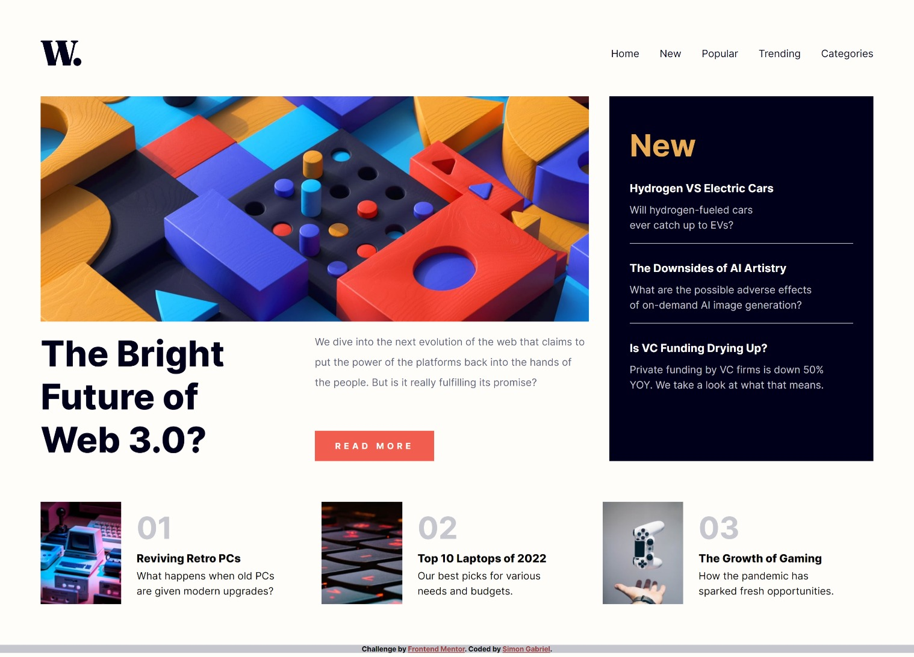

# Frontend Mentor - News homepage solution

This is a solution to the [News homepage challenge on Frontend Mentor](https://www.frontendmentor.io/challenges/news-homepage-H6SWTa1MFl). Frontend Mentor challenges help you improve your coding skills by building realistic projects. 

## Table of contents

- [Overview](#overview)
  - [The challenge](#the-challenge)
  - [Screenshot](#screenshot)
  - [Links](#links)
- [My process](#my-process)
  - [Built with](#built-with)
  - [What I learned](#what-i-learned)
  - [Continued development](#continued-development)
  - [Useful resources](#useful-resources)
- [Author](#author)
- [Acknowledgments](#acknowledgments)

## Overview

### The challenge

Users should be able to:

- View the optimal layout for the interface depending on their device's screen size
- See hover and focus states for all interactive elements on the page
- Toggle menu open and close in mobile view

### Screenshot



### Links

- [Solution URL](https://www.frontendmentor.io/solutions/news-homepage-using-css-grid-and-vanilla-javascript-m1DglFKxGn)
- [Live Site URL](https://i-strider243.github.io/news-homepage-main/)

## My process

### Built with

- Semantic HTML5 markup
- CSS custom properties
- Flexbox
- CSS Grid
- Mobile-first workflow

### What I learned

This project helped me dive into CSS Grid and the arrangement of elements on a webpage. Having been a gatekeeper for FlexBox, I must acknowledge the power of Grid. I also learnt how to place an overlay on parts of a page and prevent scroll of page when menu is open on mobile view.

```html
<button>Click me</button>
```
```css
.overlay:before {
  content: "";
  position: fixed;
  inset: 0;
  background-color: papayawhip;
  opacity: 0.5;
}
```
```js
function stopScroll{
  document.body.style.overflow = "hidden";
}
```

### Continued development

I will continue to learn more on CSS Grid and Typography using CSS Units for various elements. I would also like to improve my knowledge of CSS Transitions and Animations.

### Useful resources

- [CSS Grid by Wes Bos](https://youtube.com/playlist?list=PLu8EoSxDXHP5CIFvt9-ze3IngcdAc2xKG&si=xaOqMbIGffgq1eZK) - This helped me for all things Grid. I really liked this course and will use it going forward.

## Author

- Website - [Add your name here](https://www.your-site.com)
- Github - [i-Strider243](https://github.com/i-Strider243)
- Frontend Mentor - [@i-Strider243](https://www.frontendmentor.io/profile/i-Strider243)
- X - [@Strider18](https://x.com/Strider18)
- LinkedIn - [@SimonGabriel](www.linkedin.com/in/simon-gabriel-b71216227)

## Acknowledgments

Much of my appreciation goes to God Almighty for helping me through another project. I also want to thank Wes Bos for his amazing CSS Grid Course.
